**一、** **网页说明**

**1****、首页**

首页由logo、Banner条、主导航、主页面内容区、页面版权部分组成;

整体概览:

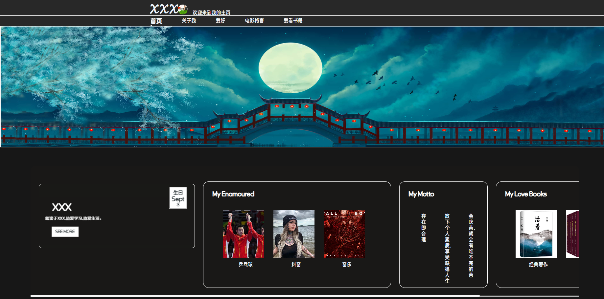

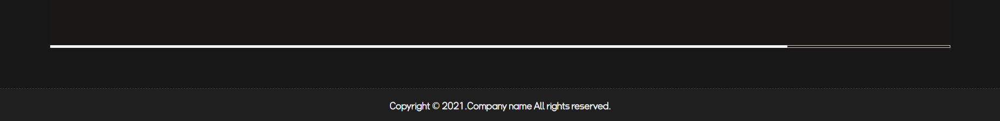

**(1)Logo****部分**

 由艺术字Zth(姓名首字母)和圆形图片构成,同时,右侧带有当前页面说明,代表当前页面为主页。

**(2)****主导航部分**

主导航紧贴logo下方,两者之间由横跨整个页面的
标签分割,具有一定高度,颜色为浅黑色;

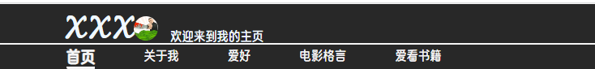

同时,当鼠标放到对应导航上时，会有字体上升粗的动画。并根据当前页面加粗加大显示对应字段，下方会带有一个无限循环的动画,。

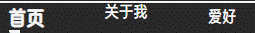

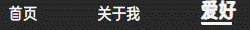

**(3)Banner****条部分**

由一张横跨整个网站的图片组成，位于主导航下方。鼠标放上时会转化为小手样式。

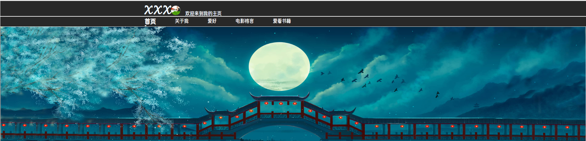

**(4)****主页面内容区部分**

网页背景由纯色组成。内容区背景色略有不同，便于区分。内容区为可滚动设计。页面过小时可以通过拖动滚动条进行浏览。

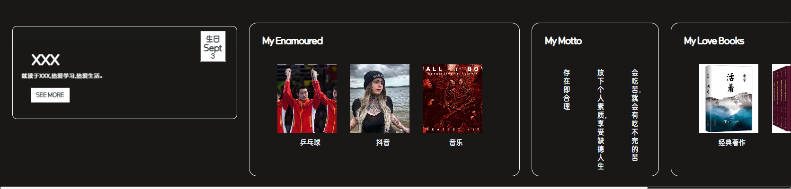

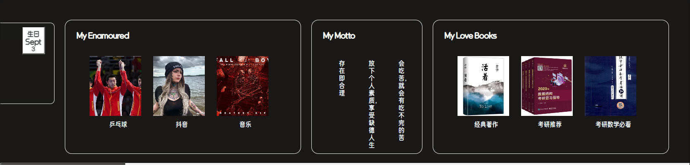

内容区分为四个区块，简略展示不同页面内容，用于跳转对应页面。分别为:关于我、爱好、电影格言、爱看书籍。每个区块均有鼠标悬停和点击动画。

**关于我**

内容区第一个区块，展示了一些基本信息。并带有3D动画。鼠标悬停时每一部分的样式有对应变化，并且可以通过点击SEE MORE按钮跳转到关于我页面。

**爱好和爱看书籍**

由上方标题部分和下方简略信息部分组成。当鼠标悬停上方标题部分时，有按钮从右侧出现的动画，并且可以通过点击按钮跳转。下方简略部分为图片及对应说明信息组成，鼠标悬停时有略微放大动画。

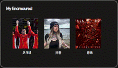

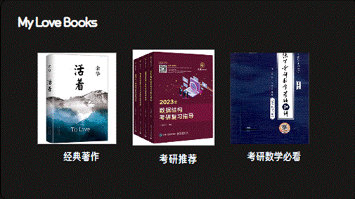

**电影格言**

由上方标题部分和下方简略信息部分组成。下方简略部分由3列文字组成，鼠标放上时由文字适当变大动画。

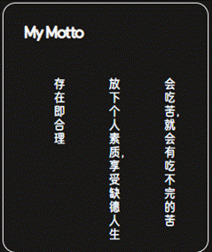 

**(5)****主页面页脚版权部分**

由黑色背景,白色字体，及外顶部边框白色虚线效果。版权条横跨整个页面。

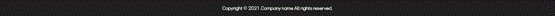

**2****、个人介绍页**

个人介绍页由logo、主导航、主页面内容区、页面版权部分组成;

整体概览:

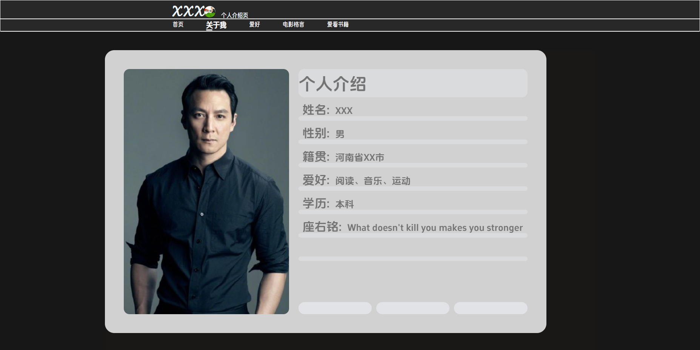

**(1)Logo****、主导航、页面版权部分**

与主页面功能一致。

**(2)****页面内容区**

网页背景由纯色组成。左侧为个人图片，右侧为个人信息。内容透明度会随时间动态变化。

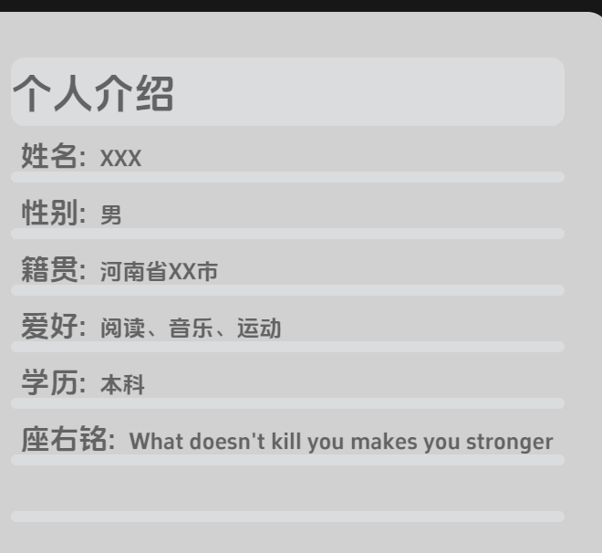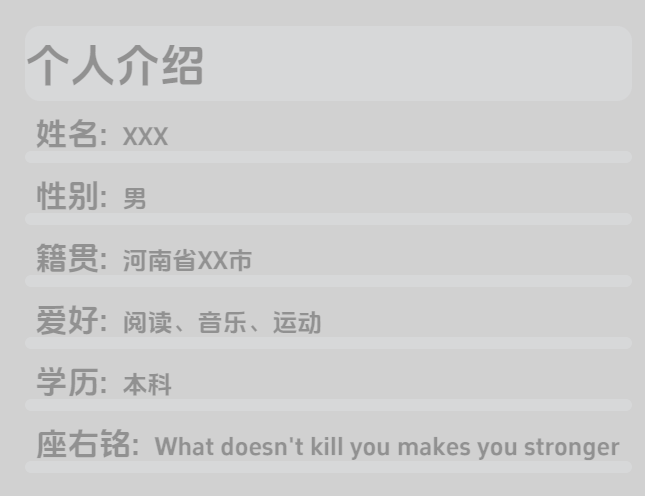

 

**3****、个人爱好页**

个人爱好页由logo、主导航、主页面内容区、页面版权部分组成;

整体概览:

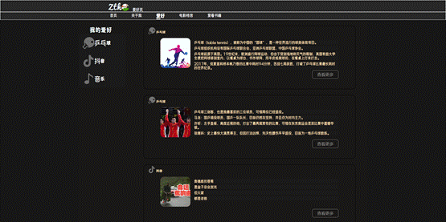

**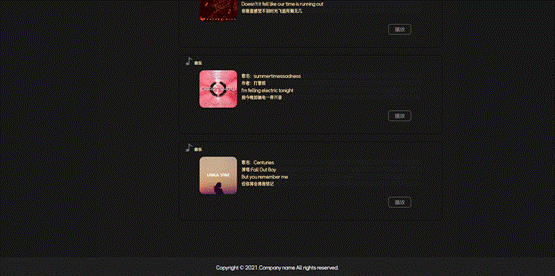**

**(1)Logo****、主导航、页面版权部分**

与主页面功能一致。

**(2)****页面内容区**

左侧为 爱好说明，表面自身爱好。鼠标悬停时有字体右侧滑动效果,点击时有左侧滑动效果。

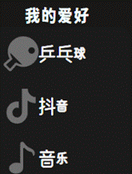

右侧区域由多个内容填充,包括乒乓球、抖音、音乐三类。鼠标悬停或点击时有对应动画。

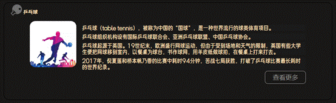

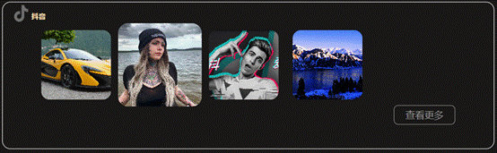

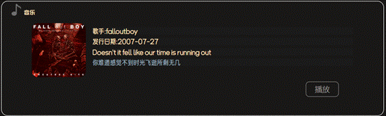

右下位置有查看更多按钮或者播放按钮,音乐类别下可点击播放或暂停。

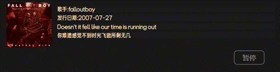

当点击播放其它音乐时，若为暂停按钮，会自动切换为播放按钮。

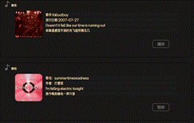

当点击左侧爱好部分时，会自动筛选出对应的内容

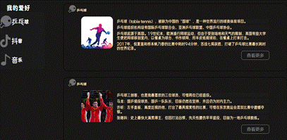

**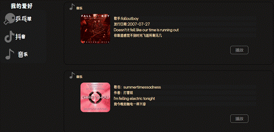**

**4****、电影格言页**

电影格言页由logo、主导航、主页面内容区、页面版权部分组成;

整体概览:

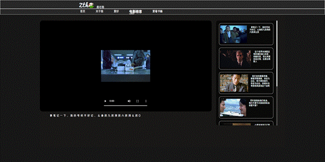

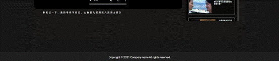

**(1)Logo****、主导航、页面版权部分**

与主页面功能一致。

**(2)****页面内容区**

主体由左侧视频区域，右侧视频列表区域，下方视频描述部分组成。

可通过点击右侧视频列表区域内的具体视频，在左侧视频及下方描述对应变化。

**左侧视频区域**

背景为黑色，竖屏视频或横屏视频均在区域内显示，鼠标悬停时有边框变换的动画

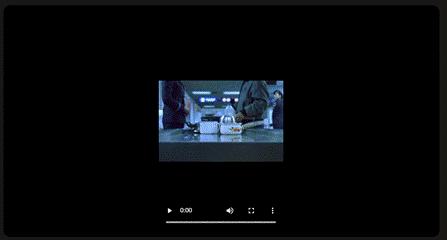

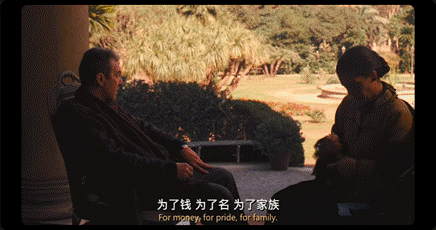

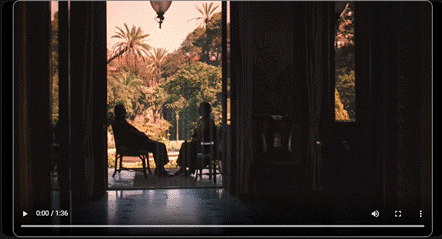

**右侧视频列表区域**

当子类超出界限时有允许滚动条，可滚动查看列表内容。

子类有白色边框，鼠标悬停或点击时有对应动画

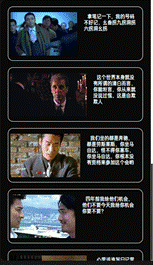

**下方视频描述部分**

首行缩进，用于展示视频描述

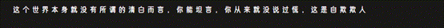

**5****、爱看书籍页**

爱看书籍页由logo、主导航、主页面内容区、页面版权部分组成;

整体概览:

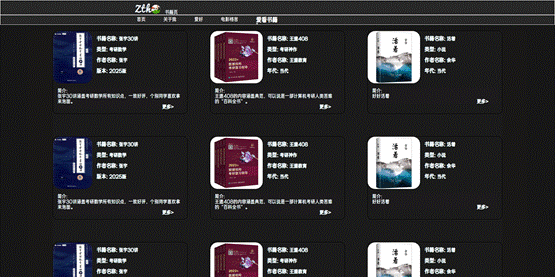

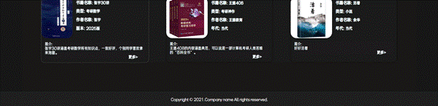

**(1)Logo****、主导航、页面版权部分**

与主页面功能一致。

**(2)****页面内容区**

九宫格排版，用于介绍书籍。包含书籍图片，书籍信息，书籍简介。鼠标悬停时有边框颜色及大小变化的动画。

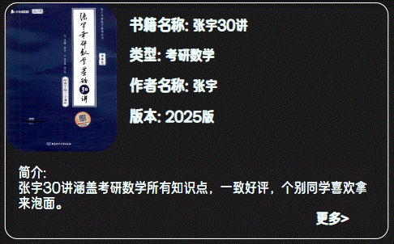

右下方有可点击元素,鼠标悬停和点击时有对应变化

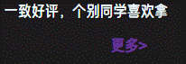