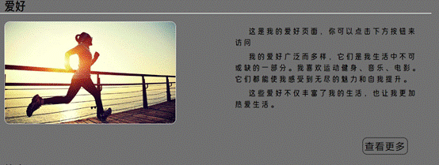
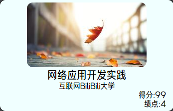
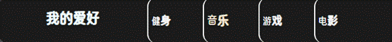

**一、** **网页说明**

**1****、首页**

首页由logo、Banner条、主导航、主页面内容区、页面版权部分组成;

整体概览:

**(1)Logo****部分**

 由艺术字Ggh(姓名首字母)组成。

**(2)****主导航部分**

主导航紧贴logo右侧,下方由横跨整个页面的
标签分割,具有一定高度,颜色为黑色;

同时,当鼠标放到对应导航上时，会有字体加粗的动画。并根据当前页面加粗显示对应字段，下方会带有一个border条的动画,。

**(3)Banner****条部分**

由一张横跨整个网站的图片组成，位于主导航下方。鼠标放上时会转化为小手样式。

**(4)****主页面内容区部分**

网页背景由白色组成。内容区背景为半透明黑色蒙版设计，便于区分。

 

 

内容区分为四个区块，简略展示不同页面内容，用于跳转对应页面。分别为:课程、日常、爱好、格言。每个区块均有鼠标悬停和点击动画。

****

****

****

**(5)****主页面页脚版权部分**

由黑色背景,白色字体，及外顶部边框白色虚线效果。版权条横跨整个页面。

**2****、课程页**

课程页由logo、主导航、左侧栏、页面内容区、页面版权部分组成;

整体概览:

**(1)Logo****、主导航、页面版权部分**

与主页面功能相同,不重复说明,。

**(2)****左侧栏**

左侧栏背景由黑色半透明。上面为个人头像及姓名。鼠标悬停头像时有放大效果。

鼠标悬停左侧栏时有颜色过度效果。悬停字体时有对应字体向右滑动动画。

!

**(2)****页面内容区**

由黑色半透明背景组成。内部为所学课程信息，可滚动设计，当课程过多时可滑动查看课程。鼠标悬停内容区域时，背景非透明度增加。

不同课程有对应动画，鼠标悬停时会自下而上弹出查看更多按钮,并且鼠标悬停或点击按钮有对应动画。

并且鼠标悬停或点击介绍信息时，有对应动画

**3****、日常页**

日常页由logo、主导航、左侧栏、页面内容区、页面版权部分组成;

整体概览:

****

**(1)Logo****、主导航、页面版权部分**

与主页面功能一致，不再重复说明。

**(2)****左侧栏**

与课程页一致，不再重复说明。

**(3)****页面内容区**

由黑色半透明背景组成，具体内容为日常作息表。鼠标悬停时会显示出隐藏的信息。

鼠标悬停或点击对应信息由相应动画。

**4****、爱好页**

爱好页由logo、主导航、左侧栏、页面内容区、页面版权部分组成;

整体概览:

**(1)Logo****、主导航、页面版权部分**

与主页面功能一致，不再重复说明。

**(2)****左侧栏**

与课程页一致，不再重复说明。

**(3)****页面内容区**

顶部为 爱好说明，列举了一些个人爱好。鼠标悬停时有字体适当变大变色效果,点击时有字体缩小变色效果。内容区域可滚动查看。

当点击顶部爱好部分时，会自动筛选出对应的内容,点击 我的爱好 会显示所有内容。

下方区域由多个内容填充,包括音乐、健身、游戏、电影三类。鼠标悬停或点击时有对应动画。自下而上出现对应按钮、鼠标悬停时字体向右滑动动画、鼠标点击按钮动画。

右下位置有查看更多按钮或者播放按钮,音乐类别下可点击播放或暂停。

当点击播放其它音乐时，若为暂停或继续按钮，会自动切换为播放按钮。

电影类别下也可点击播放或暂停视频,并且鼠标悬停电影类别时，有宽度变化动画，并出现对应视频。

**5****、格言页**

格言页由logo、主导航、左侧栏、页面内容区、页面版权部分组成;

整体概览:

**(1)Logo****、主导航、页面版权部分**

与主页面功能一致，不再重复说明。

**(2)****左侧栏**

与课程页一致，不再重复说明。

**(3)****页面内容区**

顶部为 爱好说明，列举了一些个人爱好。鼠标悬停时有字体适当变大变色效果,点击时有字体缩小变色效果。

**(1)Logo****、主导航、页面版权部分**

与主页面功能一致。

**(2)****页面内容区**

由格言组成，每个格言独占一行，鼠标悬停时有字体颜色、大小动画，点击时字体大小变小动画。

网页自适应格言数目，可通过垂直滚动条查看。

