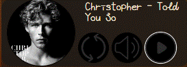
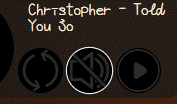
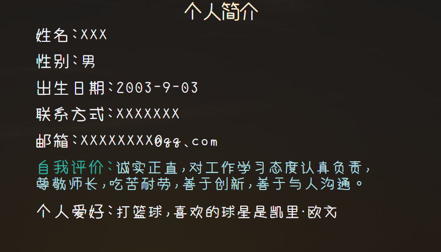
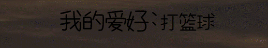
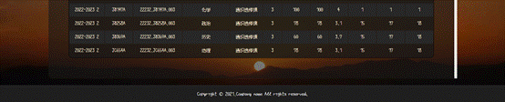
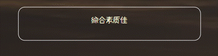

**一、** **网页说明**

**1****、首页**

首页由logo、Banner条、主导航、主页面内容区、页面版权部分组成;

整体概览:

 

**(1)logo****部分**

 由艺术字Sgz(姓名首字母)构成,同时,logo右侧带有当前页面说明,代表当前页面为主页。

**(2)****主导航部分**

主导航紧贴logo下方,两者之间由 标签分割, 标签横跨整个页面,具有一定高度,颜色为黑色;

同时,当鼠标放到对应导航上时，会有字体上升并加粗的动画。并根据当前页面加粗加大显示对应字段。

**(3)Banner****条部分**

由一张横跨整个网站的图片组成，位于主导航下方。鼠标放上时会转化为小手样式。

**(4)****主页面内容区部分**

网页背景由符合页面风格的风景图片组成。内容区域背景为半透明设计。

**上方区域**

在内容区的顶部，由四张圆形图片组成,当鼠标放上时，有图片略微放大、边框颜色变为白色的动画,并且会从下方浮现一段文字，用来表示当前图片的跳转目标。可以通过点击图片快速跳转到对应界面。

**下方区域**

由四个句子组成，不同句子在样式上略有不同，当鼠标放上时，会有字体变大的动画

 

 

 

 

 

 

 

 

 

 

**左侧部分**

是一个简易的音乐播放器,实现了点击播放、暂停、静音、切换歌曲的功能，并有对应动画。

**点击播放**

鼠标放上时: 略微变大、外边框变白色

点击:  图标变换,并且左侧图片有随歌曲旋转功能;并且再次点击会变换为播放图标，并且可以通过再次点击播放图标继续播放。

**点击静音**

通过点击切换静音，不会影响原来的播放。

**点击切换**

通过js技术对网络上的歌曲接口进行调用，根据返回的信息播放歌曲。页面首次刷新时,会默认使用本地歌曲Told You So,每次点击都会有不同的歌曲,并且左侧图片及上方歌曲信息也会对应变化。

 

**(5)****主页面页脚版权部分**

由黑色背景,白色字体，及外顶部边框白色虚线效果。版权条横跨整个页面。

**2****、个人简介页**

个人简介页由logo、Banner条、主导航、主页面内容区、页面版权部分组成;

整体概览:

**(1)Logo****、主导航、页面版权部分**

与主页面一致，不再重复说明。

**(2)****页面内容区**

网页背景由符合页面风格的风景图片组成。内容区域背景为半透明设计。

**左侧**

由固定大小的图片组成，鼠标放上时由放大及边框变白色的动画效果

**右侧**

由一个长方形区域组成,内部半透明但颜色相比底部不透明度更高。

右侧上方由个人简介四个字组成（样式与下方字体不同），下方是有关个人的一些常见信息。鼠标放上时有对应动画。

**3****、个人爱好页**

个人爱好页由logo、Banner条、主导航、主页面内容区、页面版权部分组成;

整体概览:

****

**(1)Logo****、主导航、页面版权部分**

与主页面一致，不再重复说明。

**(2)****页面内容区**

上方为 爱好说明，表面自身爱好。鼠标放上时有字体变换效果

下方由多个视频区域组成,可通过点击播放视频及双击暂停，每个视频区域右侧有对应的白色字体说明，字体设置有间距。

并且鼠标悬停视频或点击视频时有对应的动态效果

 

 

**4****、个人成绩页**

个人成绩页由logo、Banner条、主导航、主页面内容区、页面版权部分组成;

整体概览:

**(1)Logo****、主导航、页面版权部分**

与主页面一致，不再重复说明。

**(2)****页面内容区**

主体由表格组成，表格内容为自身一些学科的成绩，表格表头、不同行均有不同的样式，提高视觉效果。并且鼠标悬停或点击时有对应动画。

当表格数据过多时，会显示右侧的滚动条，可以通过鼠标滚动或拖动滚动条进行浏览。并且父容器及整个页面大小会随表格数据动态增加，不会影响网页样式。

 

 

**5****、自我评价页**

自我页由logo、Banner条、主导航、主页面内容区、页面版权部分组成;

整体概览:

**(1)Logo****、主导航、页面版权部分**

与主页面一致，不再重复说明。

**(2)****页面内容区**

自身评价通过九宫格的形式展现，鼠标悬停及点击有对应动画。并且页面内容随评价自适应变化，与个人成绩页面实现不同，父容器不会出现滚动条。

